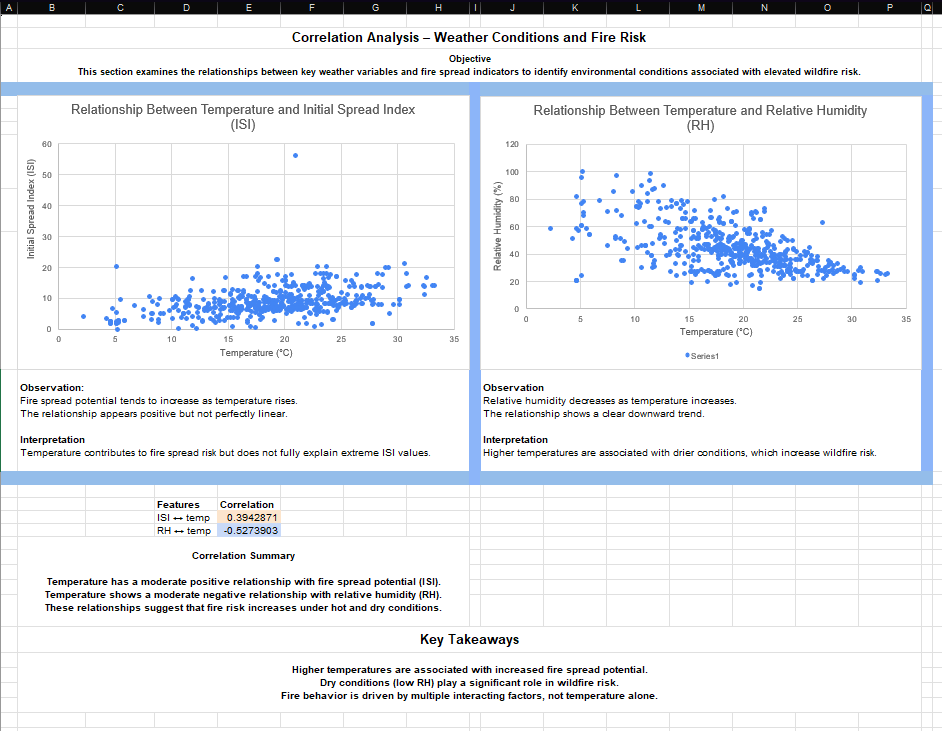
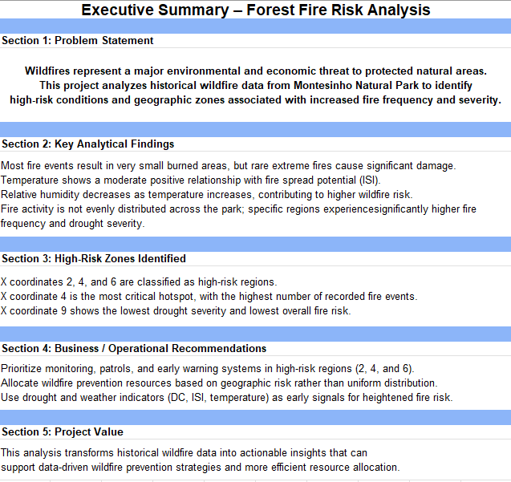

# Forest Fire Risk Analysis – Montesinho Natural Park

  

## Project Overview
Wildfires represent a significant environmental and economic threat, particularly in protected natural areas.  
This project analyzes historical wildfire data from **Montesinho Natural Park (Portugal)** to identify high-risk environmental conditions and geographic zones associated with increased fire frequency and severity.

**Goal:** Transform raw wildfire records into actionable insights that support wildfire prevention, monitoring, and resource allocation strategies.

---

## Business / Environmental Context
The analysis is conducted from the perspective of a data analyst supporting wildfire prevention efforts for a public environmental agency.

**Key Objectives:**
- Identify high-risk geographic regions within the park.
- Understand weather and drought conditions associated with increased fire spread.
- Support proactive, data-driven wildfire prevention strategies.

---

## Dataset Summary
- **Source:** Historical wildfire records from Montesinho Natural Park.
- **Time Period:** 2000 – 2003.
- **Granularity:** Each row represents a single fire event.
- **Key Features:**
  - **Spatial coordinates (X, Y):** Geographic location within the park map.
  - **Weather conditions:** Temperature, Relative Humidity (RH), Wind speed, Rainfall.
  - **Fire Weather Index (FWI) components:** FFMC, DMC, DC, ISI.
  - **Target Variable:** Burned area (hectares).

---

## Exploratory Data Analysis (EDA)
Initial exploration focuses on understanding distributions and patterns in key wildfire-related variables.

**Key Observations:**
- Most fire events result in very small burned areas.
- The burned area distribution is highly right-skewed, indicating rare but extreme fire events drive the total damage.
- Temperature follows a relatively symmetric (normal) distribution.
- **ISI (Initial Spread Index)** is right-skewed, indicating that while most days have low spread potential, specific days carry extreme risk.

---

## Correlation Analysis
Scatter plots and correlation metrics were used to examine relationships between weather conditions and fire spread indicators.

**Findings:**
- **Temperature vs Initial Spread Index (ISI):** Moderate positive correlation.
- **Temperature vs Relative Humidity (RH):** Moderate negative correlation.

*Insight:* These relationships suggest that higher temperatures contribute to drier conditions and increased wildfire risk, though temperature alone is not the sole predictor of extreme fire behavior.

---

## Geographic Risk Segmentation
Geographic segmentation was performed using spatial coordinates (X, Y) to identify regions with elevated wildfire risk.

**Key Findings:**
- Fire events are not evenly distributed across the park.
- Certain coordinates show significantly higher fire frequency (Hotspots).
- Distinct geographic zones can be classified into different fire risk levels (High, Moderate, Low) based on historical occurrence and drought severity.

---

## Executive Summary
A consolidated summary of key insights and recommendations derived from the analysis.

**Highlights:**
- **Outliers Matter:** Rare, extreme fires are responsible for the vast majority of ecological damage.
- **Early Warning:** Drought indicators (DC) and spread indices (ISI) act as critical early warning signals.
- **Spatial Strategy:** Resource allocation based on geographic risk hotspots is more effective than uniform distribution.

---

## Business / Operational Recommendations
1. **Targeted Monitoring:** Prioritize patrols and surveillance in identified high-risk geographic zones (Hotspots).
2. **Resource Allocation:** Distribute firefighting resources based on the spatial risk segmentation map.
3. **Proactive Intervention:** Use Drought Code (DC) and ISI thresholds to trigger pre-emptive alerts before fires start.
4. **Focus on Prevention:** Shift focus from reactive suppression to proactive prevention in high-risk seasons.

---

## Tools Used
- **Microsoft Excel:** Data Cleaning, Pivot Tables, Statistical Functions.
- **Data Analysis Techniques:** EDA, Correlation Analysis, Segmentation.
- **Visualization:** Histograms, Scatter Plots, Heatmaps.

---

## Author
**Created by Abdelrahman Diaa** *Aspiring AI & GeoAI Engineer | GIS Student blending Spatial Analysis with Data Science.*

Connect with me on LinkedIn:  

